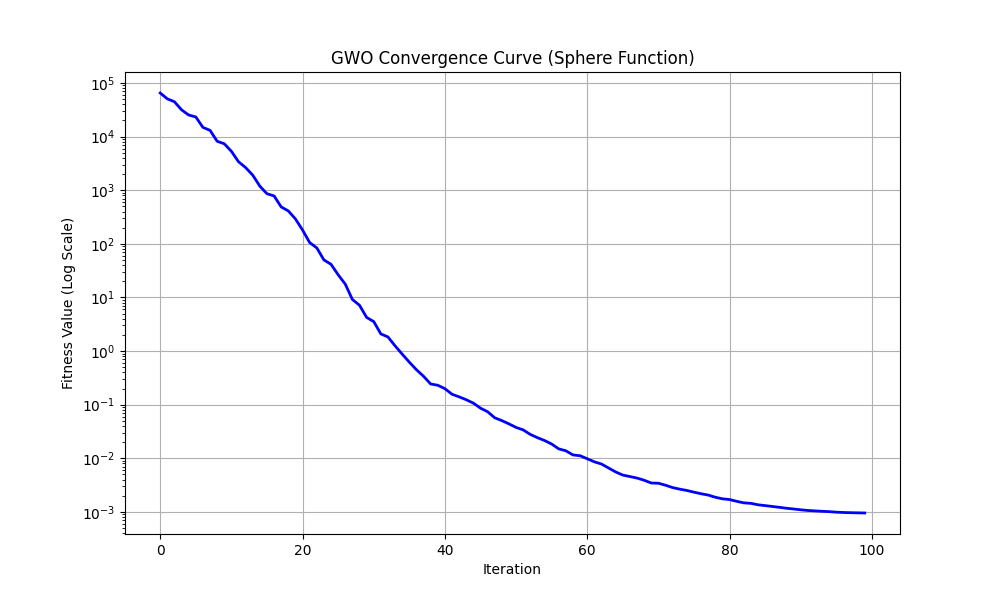
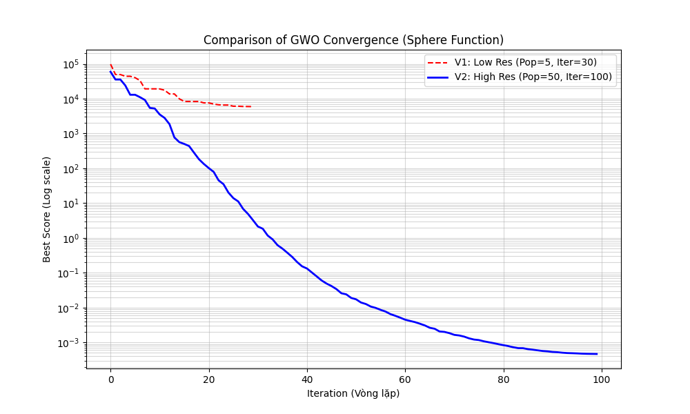

# Demo Thuật toán Bầy Sói (Grey Wolf Optimizer - GWO) với bài toán Sphere Function


## 📖 Tổng quan
Repository này chứa mã nguồn Python demo cho thuật toán **Grey Wolf Optimizer (GWO)**. Dự án được thực hiện nhằm mục đích minh họa cơ chế hoạt động, khả năng hội tụ và hiệu suất của GWO trên bài toán tối ưu hóa cơ bản.

Dự án nằm trong khuôn khổ báo cáo môn học về **Trí tuệ Bầy đàn (Swarm Intelligence)**.

## 🐺 Về thuật toán GWO
Grey Wolf Optimizer là thuật toán lấy cảm hứng từ tập tính săn mồi và cơ chế phân cấp xã hội của loài chó sói xám trong tự nhiên:
* **Alpha ($\alpha$):** Con đầu đàn, đại diện cho nghiệm tốt nhất.
* **Beta ($\beta$) & Delta ($\delta$):** Các con giữ vai trò phó đàn, hỗ trợ Alpha.
* **Omega ($\omega$):** Các cá thể còn lại, di chuyển theo sự dẫn dắt của 3 con đầu đàn.

Input:
* **dim**: (dimension) số chiều của không gian
* **pop_size**: (population size) số lượng cá thể sói trong bầy
* **max_iter**: (max iterations) số lần lặp tối đa

Output:
* **Best Score**: Giá trị nhỏ nhất của hàm mục tiêu tìm được (kỳ vọng →0).
* **Best Position**: Tọa độ của con sói Alpha tại vòng lặp cuối cùng.
* **Convergence Curve**: Biểu đồ thể hiện sự giảm dần của lỗi qua các vòng lặp.

## 🎯 Bài toán kiểm thử: Hàm Sphere
Chúng tôi sử dụng hàm Sphere để đánh giá thuật toán. Đây là một hàm lồi, đơn mode (unimodal) và không có cực trị địa phương, tiêu chuẩn để kiểm tra tốc độ hội tụ:

$$f(x) = \sum_{i=1}^{D} x_i^2$$

* **Ý nghĩa:** Kiểm chứng tốc độ hội tụ và khả năng dẫn dắt của các con sói đầu đàn ($\alpha, \beta, \delta$).
* **Mục tiêu:** Tìm cực tiểu toàn cục ($Min \to 0$ tại $x_i = 0$).
* **Không gian tìm kiếm:** $[-100, 100]$
* **Số chiều ($D$):** 30

## 📊 Kết quả thực nghiệm

### 1. Biểu đồ hội tụ (Convergence Curve)
Thuật toán cho thấy khả năng tìm kiếm nghiệm tối ưu rất nhanh ở giai đoạn đầu (Khám phá) và tinh chỉnh chính xác ở giai đoạn sau (Khai thác).


*(Kết quả chạy với 50 cá thể trong 100 vòng lặp)*

### 2. So sánh hiệu năng
Chúng tôi đã thử nghiệm 2 kịch bản để thấy sự đánh đổi giữa thời gian tính toán và độ chính xác:

| Kịch bản | Số lượng Sói | Số vòng lặp | Nhận xét |
| :--- | :--- | :--- | :--- |
| **V1 (Tài nguyên thấp)** | 5 | 30 | Chạy nhanh, nhưng độ chính xác chưa cao. |
| **V2 (Tài nguyên cao)** | 50 | 100 | Chạy lâu hơn, độ chính xác cực cao ($10^{-5}$ trở xuống). |



## 🛠️ Cài đặt và Chạy thử

   ```bash
   git clone [https://github.com/nt-thuyr/GWO-Sphere-Benchmark.git](https://github.com/nt-thuyr/GWO-Sphere-Benchmark.git)
   cd GWO-Sphere-Benchmark

   pip install requirements.txt

   python src/gwo.py [dim] [pop_size] [max_iter]
   ```

## 📚 References
Original Paper: Mirjalili, S., Mirjalili, S. M., & Lewis, A. (2014). Grey Wolf Optimizer. Advances in Engineering Software, 69, 46-61.
   
